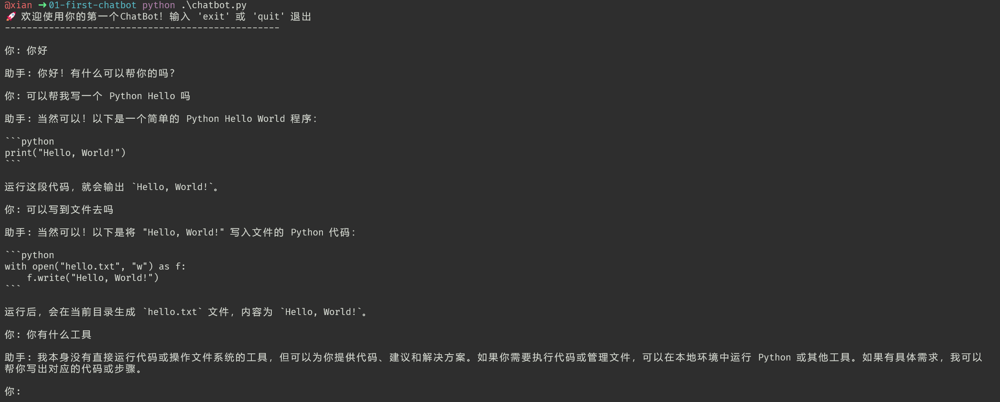

# 第一章：10分钟构建你的第一个ChatBot
> 目标：零基础快速实现一个可运行的命令行对话机器人，理解LLM对话的核心原理

---

## 🎯 核心原理

ChatBot的本质就是**维护对话上下文列表**，每次把历史消息一起传给LLM，实现多轮对话记忆。

---

## 🚀 快速开始
#### 1. 环境准备

```bash
# 1. 安装依赖（固定版本，保证100%兼容）
pip install -r requirements.txt
# 或者直接安装指定版本：pip install openai==2.30.0

# 2. 复制配置文件
cp ../../config/min-cli.json.example ~/.min-cli/min-cli.json
```

#### 2. 配置你的API密钥

编辑 `~/.min-cli/min-cli.json`：
```json
{
  "defaults": {
    "provider": "remote", // 默认使用远程接口
    "model": "gpt-3.5-turbo" // 默认模型
  },
  "providers": {
    "remote": {
      "baseUrl": "https://你的接口地址/v1", // 填OpenAI兼容的接口地址
      "apiKey": "sk-xxxxxx", // 填你的API密钥
      "api": "openai-completions", // API格式，目前固定为openai-completions，后续扩展其他类型
      "models": [{"id": "gpt-3.5-turbo", "name": "通用大模型"}]
    }
  }
}
```

#### 3. 运行ChatBot

```bash
python chatbot.py
```

### 📝 核心代码（仅100行）

```python
from openai import OpenAI
import json
from pathlib import Path

# 加载全局配置
CONFIG_PATH = Path.home() / ".min-cli" / "min-cli.json"
SYSTEM_PROMPT = "你是一个友好的AI助手，回答简洁准确。"

def load_config():
    with open(CONFIG_PATH, "r", encoding="utf-8") as f:
        config = json.load(f)
    provider = config["providers"][config["defaults"]["provider"]]
    return provider, config["defaults"]["model"]

provider, MODEL = load_config()
client = OpenAI(api_key=provider["apiKey"], base_url=provider["baseUrl"])

# 上下文记忆
messages = [{"role": "system", "content": SYSTEM_PROMPT}]

def chat(user_input):
    messages.append({"role": "user", "content": user_input})
    response = client.chat.completions.create(model=MODEL, messages=messages, temperature=0.7)
    reply = response.choices[0].message.content
    messages.append({"role": "assistant", "content": reply})
    return reply

if __name__ == "__main__":
    print("🚀 ChatBot已启动，输入exit退出\n" + "-"*50)
    while True:
        user_input = input("\n你: ").strip()
        if user_input.lower() in ["exit", "quit", "q"]:
            print("👋 再见！")
            break
        if not user_input:
            continue
        try:
            print(f"\n助手: {chat(user_input)}")
        except Exception as e:
            print(f"\n❌ 错误: {str(e)}")
```

### 运行结果



## ✨ 后续扩展方向

1. 支持命令行切换Provider/模型
2. 增加上下文长度自动截断
3. 支持`/clear`命令清空上下文
4. 支持更多API类型：Anthropic、Gemini等
5. 增加Markdown回复渲染
