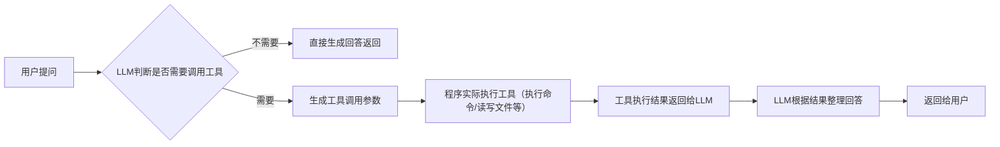

# 第二章：给ChatBot加上工具能力，做能真正干活的Agent
> 核心问题：什么是Agent？为什么普通ChatBot只能告诉你"怎么做"，而Agent能直接帮你"做"？

---

## ❓ 到底什么是Agent？
最直白的定义（结合我们的代码理解）：
> **Agent = LLM（大模型） + 工具调用能力 + 自主决策能力 + 记忆能力**
> 
> 它是能**主动帮你完成实际任务**的"智能体"，而不是只能和你聊天的机器人。

### Agent的4个核心特征（对应我们写的代码）：
1. **目标导向**：给它一个任务目标，它会自己想办法完成，不需要你指挥每一步
2. **工具调用能力**：能实际动手操作（执行命令、读写文件等），而不是只会说
3. **自主决策**：自己判断下一步该做什么，要不要调用工具、调用什么工具
4. **记忆能力**：记得之前做过什么、拿到了什么结果，能理解上下文，不会重复做无用功

### 和普通ChatBot的直观区别：
| 普通ChatBot（第一章实现的） | 工具型Agent（本章实现的） |
|------------------------------|------------------------------|
| 你问："怎么查看当前目录文件"，它回答："你可以执行ls命令" | 你问："查看当前目录文件"，它直接执行ls，告诉你："当前目录有3个文件：a.py、b.md、c.txt" |
| 只能输出文字，所有操作需要你手动完成 | 能直接操作你的电脑/系统，帮你把事做完 |
| 没有"动手"能力，只是个"顾问" | 有"动手"能力，是你的"助手" |

---

## 🎯 工作原理对比
### 普通ChatBot的工作模式

✅ 只有**文本生成能力**，所有输出都是纯文字，无法直接和你的电脑/系统交互，只能告诉你操作步骤，需要你手动执行。

---

### 带工具能力的Agent工作模式

✅ 多了**工具执行层**：LLM不再直接输出答案，而是先判断需要用什么工具，程序实际执行工具拿到结果，再交给LLM生成回答。这就是Agent能真正帮你干活的核心原理。

---

## 🚀 本章目标
实现第一个能**直接执行你电脑上的命令**的Agent，支持：
- 自动识别Windows/macOS/Linux系统，分别调用Powershell/Bash
- 执行系统命令并返回结果
- 简单的安全校验，执行前确认

---

## 快速开始
### 1. 安装依赖
```bash
pip install -r requirements.txt
```
（和第一章依赖完全一致，不需要额外安装新包）

### 2. 配置
沿用第一章的`~/.min-cli/min-cli.json`配置即可，无需修改。

### 3. 运行Agent
```bash
python agent_with_tools.py
```

#### 测试示例：
> 你：查看当前目录下的文件
>
> Agent：我需要执行ls命令查看当前目录文件，是否确认执行？[Y/n] Y
>
> 执行结果：
> README.md  agent_with_tools.py  requirements.txt
>
> 助手：当前目录下有3个文件：README.md、agent_with_tools.py和requirements.txt。

---

## 核心代码（180行）
```python
from openai import OpenAI
import json
from pathlib import Path
import subprocess
import sys
import platform

# 加载配置（和第一章完全一致）
CONFIG_PATH = Path.home() / ".min-cli" / "min-cli.json"
SYSTEM_PROMPT = """你是一个能干的AI助手，可以调用系统命令帮用户完成实际任务。
当需要执行命令时，严格按照工具调用格式返回，不要直接回答。
不要生成危险命令（删除系统文件、格式化磁盘、修改系统配置等）。"""

# 危险命令黑名单（自动拦截）
DANGEROUS_COMMANDS = [
    # Linux/macOS 危险命令
    "rm -rf /", "rm -rf /*", "mkfs", "dd if=", "shutdown", "reboot", "init 0", "init 6",
    "chmod -R 777 /", "chown -R /", "mv /home /dev/null", "rm -rf ~", "rm -rf ~/*",
    "dd if=/dev/zero of=", ":(){ :|:& };:", "fork bomb",
    # Windows 危险命令
    "del /f /s /q C:\\", "rd /s /q C:\\", "format C:", "diskpart /s", "shutdown /s",
    "shutdown /r", "Remove-Item -Recurse -Force C:\\", "Format-Volume", "rmdir /s /q C:\\"
]

def load_config():
    with open(CONFIG_PATH, "r", encoding="utf-8") as f:
        config = json.load(f)
    provider = config["providers"][config["defaults"]["provider"]]
    return provider, config["defaults"]["model"]

provider, MODEL = load_config()
client = OpenAI(api_key=provider["apiKey"], base_url=provider["baseUrl"])

# 定义可用工具：执行系统命令
tools = [
    {
        "type": "function",
        "function": {
            "name": "run_command",
            "description": "执行系统命令（Bash/Powershell），返回命令执行结果",
            "parameters": {
                "type": "object",
                "properties": {
                    "command": {
                        "type": "string",
                        "description": "要执行的系统命令"
                    }
                },
                "required": ["command"]
            }
        }
    }
]

def is_dangerous_command(command: str) -> bool:
    """检查是否是危险命令"""
    command_lower = command.lower()
    for dangerous in DANGEROUS_COMMANDS:
        if dangerous.lower() in command_lower:
            return True
    return False

def run_command(command: str) -> str:
    """执行系统命令，跨平台支持"""
    # 先拦截危险命令
    if is_dangerous_command(command):
        return f"❌ 已拦截危险命令：`{command}`\n为了系统安全，此类高危操作禁止自动执行，请手动确认后操作。"

    # 确定系统类型，选择对应的shell
    os_type = platform.system()
    if os_type == "Windows":
        shell = ["powershell", "-Command"]
    else:
        shell = ["bash", "-c"]
    
    try:
        result = subprocess.run(
            shell + [command],
            capture_output=True,
            text=True,
            timeout=30
        )
        if result.returncode == 0:
            return f"执行成功：\n{result.stdout}"
        else:
            return f"执行失败，错误信息：\n{result.stderr}"
    except Exception as e:
        return f"执行出错：{str(e)}"

# 上下文记忆
messages = [{"role": "system", "content": SYSTEM_PROMPT}]

def chat(user_input):
    messages.append({"role": "user", "content": user_input})
    
    # 第一步：调用LLM，传入工具定义
    response = client.chat.completions.create(
        model=MODEL,
        messages=messages,
        tools=tools,
        tool_choice="auto",
        temperature=0.7
    )
    
    response_message = response.choices[0].message
    
    # 第二步：判断LLM是否需要调用工具
    if response_message.tool_calls:
        for tool_call in response_message.tool_calls:
            if tool_call.function.name == "run_command":
                # 解析命令参数
                args = json.loads(tool_call.function.arguments)
                command = args["command"]
                
                # 执行命令（危险命令会被自动拦截）
                print(f"\n🔧 正在执行命令：`{command}`")
                result = run_command(command)
                print(f"\n执行结果：\n{result}")
                
                # 把工具执行结果加入上下文，再次调用LLM生成回答
                messages.append(response_message)
                messages.append({
                    "tool_call_id": tool_call.id,
                    "role": "tool",
                    "name": "run_command",
                    "content": result
                })
                
                # 第二次调用LLM，传入工具结果
                second_response = client.chat.completions.create(
                    model=MODEL,
                    messages=messages
                )
                return second_response.choices[0].message.content
    else:
        # 不需要调用工具，直接返回回答
        return response_message.content

if __name__ == "__main__":
    print("🚀 工具型Agent已启动，输入exit退出")
    print("⚠️  【免责声明】本工具仅用于学习用途，执行命令的风险由用户自行承担，开发者不承担任何责任。")
    print("✅ 安全机制：已自动拦截常见危险命令，普通命令将直接执行，无需确认。")
    print("可以让我帮你执行系统命令，比如：查看当前目录文件、查看系统版本、列出Python版本等")
    print("-" * 70)
    while True:
        user_input = input("\n你: ").strip()
        if user_input.lower() in ["exit", "quit", "q"]:
            print("👋 再见！")
            break
        if not user_input:
            continue
        try:
            print(f"\n助手: {chat(user_input)}")
        except Exception as e:
            print(f"\n❌ 错误: {str(e)}")
```

---

## ✨ 重点理解
1. **工具调用的本质**：这就是Function Call（函数调用）能力，是LLM从"聊天机器人"变成"智能Agent"的核心转折点
2. **为什么普通ChatBot不能干活，Agent可以**：
   - 普通ChatBot：只有文本生成能力，所有输出都是纯文字，无法和你的系统交互，只能告诉你操作步骤
   - 工具型Agent：多了**工具执行层**，LLM生成工具调用参数，程序实际执行操作，拿到结果再生成回答，真正帮你完成任务
3. **安全机制说明**：
   - 内置危险命令黑名单，自动拦截删除系统文件、格式化磁盘、关机等高危操作
   - 普通查询类命令（ls、dir、python --version等）直接执行无需确认，使用体验流畅
   - 明确的免责声明：工具仅用于学习，执行风险用户自行承担
4. **扩展性**：现在只有`run_command`一个工具，后续可以无限扩展：读写文件、调用API、操作数据库等等，加多少工具Agent就有多少能力。

---

## 后续扩展方向
1. 支持更多工具：文件读写、网页搜索、计算器等
2. 增加危险命令识别和拦截
3. 支持并行调用多个工具
4. 支持工具返回结果自动判断是否需要多轮调用
